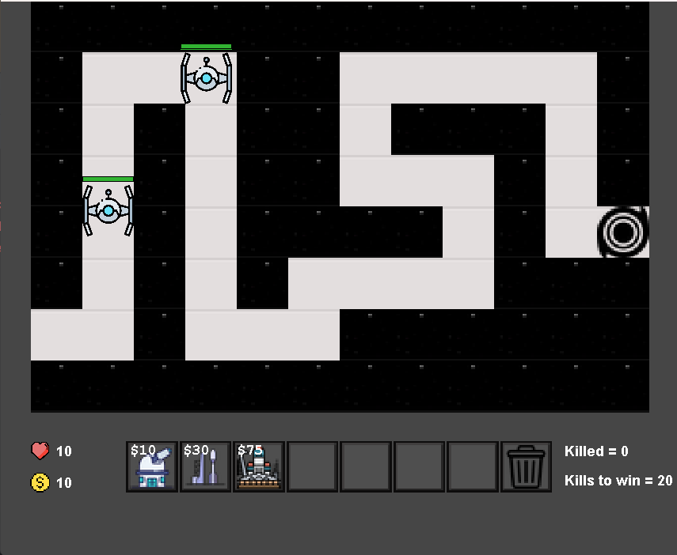
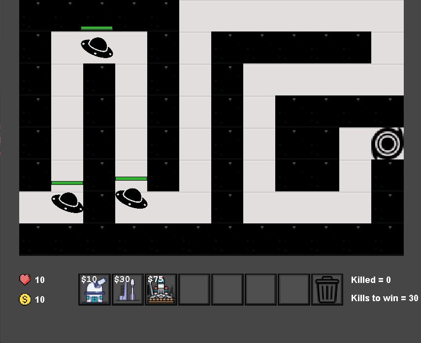
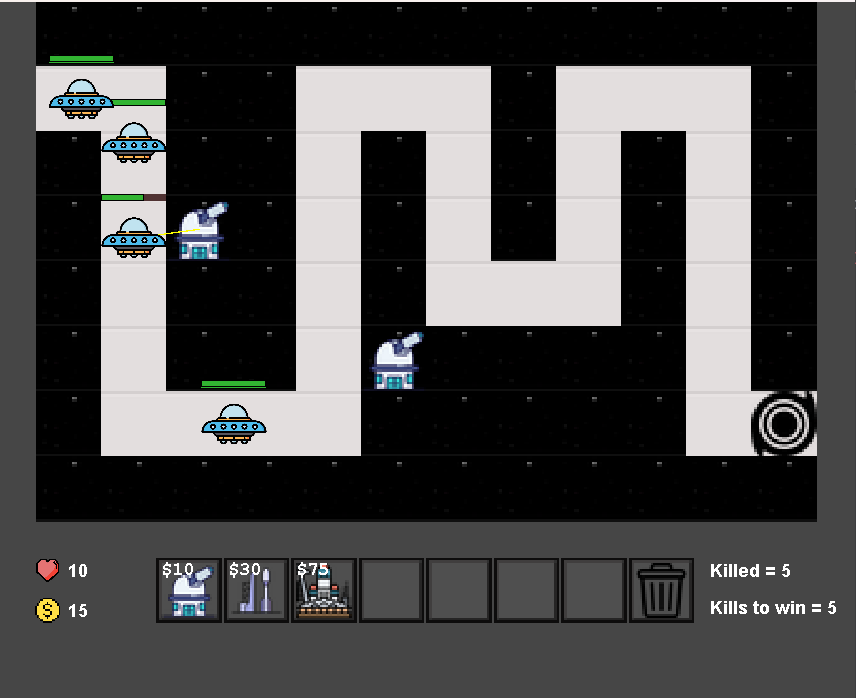
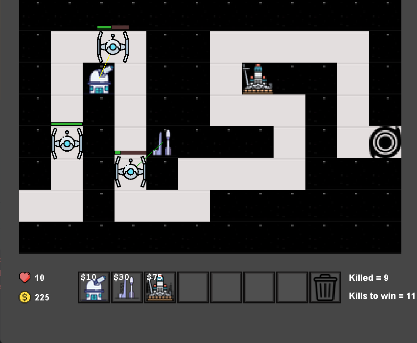
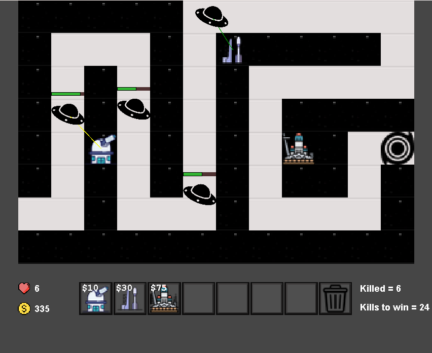
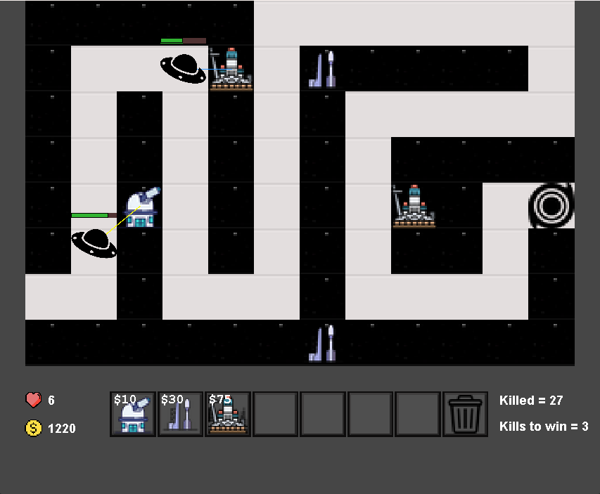

# Tower Defense (Java Game)

A classic Tower Defense game built in Java! Defend your base from waves of alien invaders by strategically placing towers along the path.

---

## Game Features

- **Custom Maps**: Create your own maps — 3 included maps to start with.
- **3 Enemy Types**: Each enemy has unique abilities and health levels.
- **3 Tower Types**: Choose from 3 different towers, each with unique attack styles and range.
- **Interstellar Soundtrack**: Background music inspired by *Interstellar* adds immersion.
- **Victory Goals**: Kill a certain number of mobs to win the game.
- **Java Based**: Built entirely with Java for learning and fun!

---

<pre>
## Project Structure
TowerDefense
├── 📁 .settings # Eclipse project settings
├── 📁 bin # Compiled class files
├── 📁 res # Game graphics
│ ├── cell.png
│ ├── coin.png
│ ├── heart.png
│ ├── mob1.png, mob2.png, mob3.png
│ ├── tileset_air.png
│ └── tileset_ground.png
├── 📁 save # Map data
│ ├── map1
│ ├── map2
│ └── map3
├── 📁 src # Source code
│ ├── Block.java
│ ├── Frame.java
│ ├── KeyHandel.java
│ ├── Mob.java / Mob2.java / Mob3.java
│ ├── Room.java
│ ├── Save.java
│ ├── Screen.java
│ ├── Store.java
│ └── Value.java
├── .classpath
├── .project
└── interstellar.wav # Background music
</pre>


---

## How to Run

   ```bash
   git clone https://github.com/yourusername/tower-defense-java.git
      cd tower-defense-java

   Compile the game:
      javac -d bin src/*.java

   javac -d bin src/*.java
      java -cp bin Frame
  ```


---
#Mobs
<br>


---
Gameplay
<br>
<table>
  <tr>
    <td></td>
    <td></td>
  </tr>
     <tr>
    <td></td>
    <td></td>
  </tr>
     <tr>
    <td></td>
    <td></td>
  </tr>
     <tr>
    <td></td>
  </tr>
</table>


